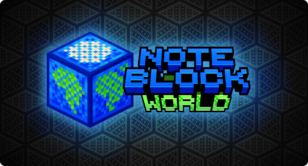

  

  <strong>
    A website to share, discover and listen to note block music from all around the world!
  </strong>

  👥 <a href="https://discord.gg/note-block-world-608692895179997252">Discord</a> • 
  📆 <a href="https://github.com/orgs/OpenNBS/projects/4">Roadmap</a> • 
  🗨 <a href="https://github.com/OpenNBS/NoteBlockWorld/issues/new/choose">Feedback</a> • 
  ☕ <a href="https://opencollective.com/opennbs/donate">Buy us a coffee!</a>

## ℹ About the project

[**Note Block World**](https://noteblock.world/) is a collaborative, social website where users can share their note block songs made with [Note Block Studio](https://noteblock.studio/). Our goal is to give the NBS community a platform to share their creations with the world, discover new music and connect with other creators!

## 💬 Issues/Feedback

If you have found an issue or would like to suggest a feature, please open a [new issue](/issues/new/choose) on the repository. Make sure to check out the [project roadmap](https://github.com/orgs/OpenNBS/projects/4) to see if the feature you want to work on is already planned. We are always looking to improve the website and would love to hear your thoughts!

## 🔧 Contributing

We welcome contributions to the project! Read our [contributor guide](CONTRIBUTING.md) to set up the project and get started.

Please [open an issue](/issues/new/choose) discussing the changes you would like to make before submitting a pull request. Alternatively, you can join our [Discord server](https://discord.gg/open-note-block-studio-608692895179997252) to discuss the changes with our development team!

## ❤ Donate

If you would like to support the project, you can donate via our [Open Collective](https://opencollective.com/opennbs/donate) or [GitHub Sponsors](https://github.com/sponsors/OpenNBS)! Your donations help us cover the costs of running the website and allow us to dedicate more time to its development.

Thanks to all our current and past sponsors for helping us keep Note Block World spinning!

###### Supporters

---

This project is licensed under the GNU Affero General Public License (AGPL 3.0). See the [LICENSE](LICENSE) file for details.
